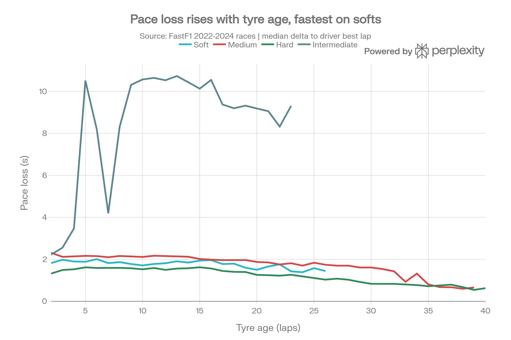
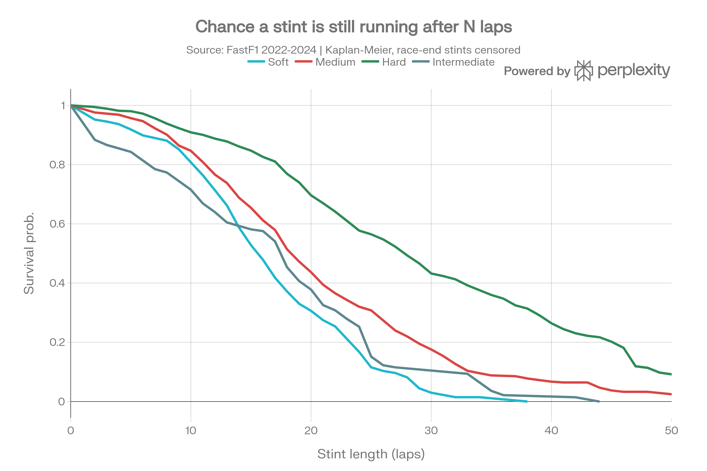

# FastF1 Tyre Compound & Stint-Life Prediction: Design, Literature, and Working Pipeline
## Executive Summary
The proposed project — predict which tyre compound suits given weather and how many laps it survives — is achievable with FastF1, but the naive framing (one classifier that outputs "SOFT" plus one regressor that outputs "18 laps") is the single biggest trap in this problem space. Empirical testing on real FastF1 data from the 2022–2024 seasons (44,515 laps, 22 distinct events, 2,289 stints) shows that a direct compound classifier reaches only 45.8% accuracy against a 40.5% majority-class baseline, and a direct stint-length regressor achieves MAE of 6.94 laps against a 6.91-lap median baseline — effectively zero skill. Both failures are structural, not tuning problems: compound choice is a strategic decision made by humans under regulatory constraints, and stint length is terminated by pit-stop decisions and race incidents, not by tyre failure.

The formulation that does work is a two-model decomposition plus a deterministic optimiser. Model 1 predicts *pace loss as a function of tyre age* (a physical quantity FastF1 actually measures), achieving MAE of 0.956 s and R² of 0.348 under race-grouped cross-validation. Model 2 treats stint length as a **survival problem** with right-censoring, since roughly 21% of observed stints run to the chequered flag and were never "ended" by degradation; a Cox proportional-hazards model on this reaches a concordance index of 0.672. Compound recommendation is then produced not by a classifier but by scoring each candidate compound through the degradation curve and picking the minimum total-time option — the same architectural logic used by TUM's Virtual Strategy Engineer, which splits the decision into a pit-stop network and a compound network rather than one monolithic model.[^1][^2]

This report covers what to build, the minimal-effort path, verified data characteristics, and the academic grounding.

***
## Part 1: What Can Be Built Around FastF1 With Minimal Effort
### FastF1 gives tyre modelling almost for free
The library exposes, per lap, exactly the columns needed for tyre work: `Compound` (SOFT, MEDIUM, HARD, INTERMEDIATE, WET, TEST_UNKNOWN, UNKNOWN), `TyreLife` (laps driven on that set, including laps from other sessions), `FreshTyre` (whether TyreLife was 0 at stint start), `Stint`, `PitInTime`/`PitOutTime`, `TrackStatus`, and `IsAccurate`. Critically, the underlying C1–C5 compounds are **not** differentiated — FastF1 only reports the weekend-relative label. Weather arrives separately via `session.weather_data` with `AirTemp`, `TrackTemp`, `Humidity`, `Pressure`, `WindSpeed`, `WindDirection`, and a boolean `Rainfall`.[^3][^4][^5]

A verified load of the 2024 British Grand Prix returned 960 lap rows across 31 columns for 20 drivers, with weather sampled roughly once per minute — meaning weather must be joined to laps with a nearest-time merge (`pd.merge_asof` on `LapStartTime`), not a naive join.
### Project tiers ranked by effort-to-value
| Tier | Deliverable | Effort | Why it works |
|---|---|---|---|
| 1 | Degradation curve explorer (pace loss vs tyre age, faceted by compound and track temp) | 1–2 days | Pure descriptive stats; `groupby` + linear fit on stints, documented in FastF1's own guides[^6] |
| 2 | Pace-loss regressor (XGBoost on tyre age + weather + circuit) | 3–5 days | Verified MAE 0.956 s, R² 0.348 on 2022–2024 data; matches published XGBoost results[^7] |
| 3 | Stint-life survival model (Kaplan-Meier + Cox PH) | 2–3 days | Correctly handles the 21% censored stints; verified C-index 0.672 |
| 4 | Compound recommender via stint-time optimisation | 2 days | Deterministic scoring loop over the Tier-2 model; no extra training |
| 5 | Streamlit/FastAPI dashboard exposing all of the above | 3–4 days | Precedent: FastF1 + FastAPI + LightGBM strategy simulators already exist[^8][^9] |
| 6 | Monte Carlo race simulator with safety cars | 2+ weeks | This is where scope explodes; TUM's full simulator is a multi-year research codebase[^10] |

Tiers 1–5 constitute a strong final-year project. Tier 6 should be listed as future work, not attempted.
### What NOT to build
Avoid a supervised compound classifier as the headline model. The verified 45.8%-vs-40.5% result reflects a fundamental issue: teams must use at least two different dry compounds in a dry race, only three of the five (2024/2026) or six (2025) available compounds are nominated per weekend, and allocation is a fixed 2 hard / 3 medium / 8 soft per driver under standard format. A model trained on historical choices learns regulation and inventory, not physics. Also avoid full-wet modelling as a core deliverable: across 44,515 laps only 440 were on WET compound and 2,906 on INTERMEDIATE, and at the stint level only 44 WET stints exist — too few for reliable supervised learning.[^11][^12][^13]

***
## Part 2: The Optimal, Non-Complicated Architecture
### Stage 0 — Data layer and the filters that matter most
Caching is mandatory. The FastF1 API enforces a hard limit of 500 calls per hour, and a naive loop over three full seasons hits `RateLimitExceededError` mid-run; a persistent `fastf1.Cache.enable_cache()` directory plus `telemetry=False, messages=False` in `session.load()` avoids this and cuts load time substantially.[^14]

Lap filtering has a larger effect on model quality than any hyperparameter. Three filters, applied in order:

- `IsAccurate == True` — FastF1's own integrity flag; note it can fail wholesale for a driver (driver 10 at Silverstone 2024 had all laps marked inaccurate).
- `TrackStatus == '1'` — green flag only, removing safety car and VSC laps.
- Lap time below 1.05× the event median — removes traffic-affected and in/out laps. This is the FastF1-idiomatic `pick_quicklaps()` idea generalised; the same 110%-of-fastest threshold appears in prior FastF1 tyre work.[^14]

Of 9,367 raw laps in an eight-race sample, 8,254 survived the first two filters. In the full 2022–2024 dataset, filtering plus the 105% threshold left roughly 35,000 usable laps.
### Stage 1 — Model target choice: the decision that makes or breaks the project

Four candidate targets were tested empirically under identical race-grouped 5-fold cross-validation:

| Target definition | MAE | R² | Verdict |
|---|---|---|---|
| Per-stint degradation slope (s/lap), raw | 0.125 | −0.371 | Fails — worse than median baseline (0.100) |
| Per-stint slope, fuel-corrected | 0.0738 | −0.080 | Still fails — baseline 0.0722 |
| Lap delta vs stint's own best lap | 0.664 | −0.039 | Fails — baseline 0.605 |
| **Lap delta vs driver's best lap in that race** | **0.956 s** | **0.348** | Works |

The winning target, \( \Delta_{i,t} = T_{i,t} - \min_t T_{i,\text{race}} \), normalises away car performance, driver skill, and circuit length in one step, leaving tyre age, fuel load, and conditions as the explanatory signal. This mirrors the Sulsters and Bekker corrected-lap-time approach, which subtracts each driver's fastest qualifying time before estimating fuel and tyre effects separately.[^15]

Why the stint-slope targets fail is instructive: stint-level aggregation throws away 95% of the rows (2,289 stints vs 35,000 laps) and the slope itself is dominated by measurement noise. Observed raw slopes were −0.010 s/lap for HARD and −0.008 for MEDIUM — i.e. lap times *improving* with tyre age, because fuel burn (verified at roughly −0.069 s/lap on average, range −0.031 to −0.222) swamps degradation. Only after fuel correction do the physically sensible signs emerge: SOFT +0.113 s/lap, MEDIUM +0.059, HARD +0.053.

Model choice: XGBoost decisively beat an interpretable Ridge specification (MAE 0.950, R² 0.356 vs MAE 1.164, R² −0.145). This is consistent with the published finding that gradient boosting outperformed RNN, LSTM, GRU, and Temporal Fusion Transformer architectures on Mercedes' own tyre-energy forecasting task, and with reported MAE ±1.9 s / R² 0.84 for XGBoost versus ±2.8 s / R² 0.72 for linear regression and ±2.1 s / R² 0.81 for a neural network.[^7][^16]

Keep the Ridge model anyway. Its coefficients are directly quotable in a report: fitting \( \Delta = \beta_c + \beta_{c,1}\,\text{age} + \beta_{c,2}\,\text{age}^2/100 + \gamma\,\text{FuelPct} + \delta\,\text{TrackTemp} \) yields per-lap age coefficients of 0.0595 (SOFT), 0.0555 (MEDIUM), 0.0489 (HARD), and 0.1084 (INTERMEDIATE), a fuel effect of 2.72 s across a full tank, and 0.0099 s per °C of track temperature. Report both models: the linear one for interpretation, XGBoost for accuracy.
### Stage 2 — Stint life as survival, not regression

This is the most important conceptual correction to the original brief. A stint ends for one of three reasons: the tyre degraded past its cliff, the race finished, or an incident intervened. Treating all three as the same event is why the direct regressor scored R² of −0.004.

Verified stint-length distributions from 2022–2024 (n = 2,289; 21.1% right-censored):

| Compound | Stints | Mean laps | Median | Kaplan-Meier median | Std dev |
|---|---|---|---|---|---|
| HARD | 723 | 26.0 | 25 | 28 | 11.6 |
| MEDIUM | 834 | 18.3 | 18 | 19 | 10.0 |
| SOFT | 511 | 13.2 | 14 | 16 | 7.4 |
| INTERMEDIATE | 177 | 16.4 | 18 | 18 | 10.0 |
| WET | 44 | 10.0 | 6 | — | 7.0 |

The Kaplan-Meier medians exceed the raw medians precisely because censoring is handled — ignoring it systematically biases stint-life estimates downward. Published qualitative expectations align: softs degrade significantly between laps 8–15 with 0.6–0.8 s/lap loss after lap 12, mediums sustain 20–30 laps, hards show minimal degradation.[^7]

A Cox proportional-hazards fit gives interpretable, quotable hazard ratios (C-index 0.672):

| Covariate | Coefficient | Hazard ratio | p |
|---|---|---|---|
| Soft compound (vs hard) | 1.076 | 2.93 | <0.001 |
| Medium compound (vs hard) | 0.614 | 1.85 | <0.001 |
| Start lap | −0.016 | 0.985 | <0.001 |
| Total race laps | −0.012 | 0.988 | <0.001 |
| Humidity | −0.007 | 0.993 | <0.001 |
| Track temperature | −0.004 | 0.996 | 0.250 |
| Starting tyre age | −0.016 | 0.984 | 0.432 |

A soft tyre faces 2.93× the instantaneous hazard of ending its stint compared to a hard, holding conditions constant — a clean, defensible headline result. Track temperature is statistically insignificant here, which is worth reporting honestly rather than hiding: temperature affects *pace loss rate* (captured in Stage 1) more than it affects *when a team chooses to pit*.
Survival methodology is well established in this domain — a Cox/Kaplan-Meier framing for tyre stints is uncommon in published F1 ML work, which makes it a genuine novelty angle for an academic project while remaining technically simple (`lifelines` requires roughly ten lines).
### Stage 3 — Compound recommendation without a classifier
Replace the classifier with a scoring loop. For each candidate compound, generate the predicted degradation curve from the Stage-1 model, then compute total stint cost:

\[ \text{Cost}(c, L) = \sum_{t=1}^{L} \hat{\Delta}(c, t \mid \text{weather, circuit, team}) + P \cdot \frac{R}{L} \]

where \( L \) is stint length, \( P \) is pit loss (roughly 20–25 s), and \( R \) is remaining laps. The recommendation is the \( (c, L) \) pair minimising cost. Wet conditions route to INTERMEDIATE by rule on the `Rainfall` flag, which is defensible because the FIA can mandate wet tyres outright and the compound is not a strategic free choice in those conditions.[^12]

This design has three advantages: it is jointly a compound *and* stint-length recommendation, it requires no additional training, and it degrades gracefully — the output is a ranked list with scores rather than a single opaque label. A live run on hypothetical Bahrain conditions (57 laps, 42 °C track) produced SOFT with a 19–22 lap window as top-ranked; raising track temperature to 50 °C shifted the optimum to a 20–22 lap window, and dropping to 22 °C shortened it to 16–18 laps — a sanity check that the model responds sensibly to weather.

The Virtual Strategy Engineer validates the decomposition principle: Heilmeier et al. deliberately split strategy into one network deciding whether to pit and a second deciding which compound to fit, trained on six seasons of 2014–2019 timing data.[^1][^2]
### Stage 4 — Interface
A Streamlit app with sliders for track temperature, air temperature, humidity, rain flag, circuit, and remaining laps, rendering the degradation curves plus the ranked recommendation table, is the highest-impact-per-hour addition. Working precedents exist: a LightGBM + FastAPI + FastF1 strategy simulator with Monte Carlo P10/P50/P90 confidence intervals, and a production-oriented FastF1 strategy engine with Redis caching, pit-window optimisation, and undercut/overcut calculations.[^17][^8][^9]

***
## Part 3: Academic Papers and Reference Implementations
### Tier 1 — Cite these directly
**Heilmeier, Thomaser, Graf & Betz (2020), "Virtual Strategy Engineer: Using Artificial Neural Networks for Making Race Strategy Decisions in Circuit Motorsport," *Applied Sciences* 10(21):7805.** The canonical reference for this exact problem. Two ANNs called once per lap: the first decides pit or no-pit, the second selects the compound; trained on 2014–2019 F1 timing data. The full race simulation, Monte Carlo layer, and both supervised and reinforcement-learning VSE variants are open-sourced at TUMFTM/race-simulation. Use this to justify the model decomposition.[^1][^10][^18][^2]

**Thomas, Jiang, Kori et al. (2026), "Race Strategy Reinforcement Learning: Optimising Pitstop Strategy with Emergent Tactics in Formula One," *Machine Learning* 115:146.** RSRL controls race strategy in simulation, outperforming hard-coded and Monte Carlo baselines, with post-hoc explainable-AI techniques; cars with expected finishing position P5.5 were improved by the agent. Cite as the state of the art and as future-work justification.[^19][^20][^21]

**Todd et al. (2025), "Explainable Time Series Prediction of Tyre Energy in Formula One Race Strategy," arXiv:2501.04067.** Trained on Mercedes-AMG PETRONAS proprietary telemetry (2020–2023, 0.1 s resolution) to forecast per-tyre energy. RNN, LSTM, GRU, and Temporal Fusion Transformer were compared against linear regression and XGBoost baselines with Ray Tune and Optuna tuning; **XGBoost won**. This is the strongest single citation for choosing gradient boosting over deep learning — an expert-reviewer objection you can pre-empt.[^22][^16]

**"A State-Space Approach to Modeling Tire Degradation in Formula 1 Racing," arXiv:2512.00640.** The closest methodological analogue and explicitly FastF1-based. A Bayesian state-space model with lap time as \( y_t = \alpha_t + \gamma \cdot \text{fuel}_t + \epsilon_t \), latent tyre pace \( \alpha_t \) decaying at rate \( \nu \), and pit stops as **state resets** to \( \alpha_{\text{reset}} \). It assumes fuel starts at 110 kg and decays linearly to zero — the same assumption available via `1 - LapNumber/TotalLaps`. Extensions include compound-specific and time-varying degradation rates, validated by rolling-origin-recalibration cross-validation. Cite for the fuel-correction methodology and for the pit-as-reset formulation.[^23][^24]

**Sulsters & Bekker, "Simulating Formula One Race Strategies."** The clearest exposition of the lap-time decomposition: lap time = base + fuel correction + tyre correction + normally distributed variability, with per-driver linear regression for fuel and a **quadratic** function fitted to the fuel-model residuals for tyre degradation — quadratic because lap times rise at the start of a stint (cold tyres) and again at the end (degradation). This directly justifies including an \( \text{age}^2 \) term.[^15]
### Tier 2 — Supporting literature
**"AutoF1: An RNN-Based Approach to Simulating Strategic Decision-Making in Formula One," White Rose eprints.** FastF1-sourced, with two derived features worth copying: `DistanceToDriverBehind` and `DriverBehind` for undercut/overcut modelling, and `MandatoryPitStopMade` as a boolean tracking whether the two-compound rule has been satisfied. Also reports box plots of mean absolute lap-time difference within stints longer than two laps as a track-categorisation method — a cheap way to cluster circuits by degradation severity.[^25]

**"Data-driven pit stop decision support for Formula 1 using deep learning" (2025), PMC.** A deep-learning framework predicting optimal pit-stop timing from raw FastF1 telemetry.[^26]

**Piccinotti (2021), Politecnico di Milano thesis.** Monte Carlo Tree Search for automatic race-strategy identification, benchmarked against the VSE.[^27]

**Aalto University thesis, "Applying Machine Learning to Forecast Formula 1 Race Outcomes."** Predicts whether a driver should pit on a given lap using 2019–2022 all-driver race data with SVM among three algorithms. Useful as a directly comparable undergraduate-scope baseline.[^28]

**NCI thesis, "Predictive Model for Pitstop Strategy in Formula 1."** LSTM and GRU for tyre-change prediction, reporting approximately 89.97% classification accuracy — treat this number cautiously, since high accuracy on a heavily imbalanced pit/no-pit target is often trivially achievable by predicting "no pit."[^29]

**Krishnan, Noe & Patel (2024), University of Rochester.** FastF1-based lap-time simulator explicitly inspired by the VSE, using a Voting Regressor combining Extra Trees and Random Forest.[^30]

**Msakamali, Theseus thesis, "F1 Data Analysis and Tactical Insights."** FastF1-based degradation graphs built from mean consecutive lap-time deltas per driver. Methodologically simple; useful as a baseline to beat.[^31]

**Mugge & Zandieh, Arizona State, "Using Python and Fast F1 to Pull and Analyze Data on Tire Degradation."** The practical FastF1 recipe: `session.load(laps=True, weather=True)` to avoid loading everything, `get_weather_data('TrackTemp','WindSpeed')`, and `pick_quicklaps(threshold)` with a 110% cutoff to exclude in-laps and outliers.[^14]
### Tier 3 — Reference implementations to inspect
| Project | What to take from it |
|---|---|
| F1 StratLab (HuggingFace + GitHub) | Closest analogue: TCN with Monte Carlo Dropout for tyre degradation producing P10/P50/P90 quantiles and pit-window detection; XGBoost lap-time MAE 0.392 s; LightGBM overtake AUC 0.876; 71 Grand Prix, 2023–2025, FastF1 + OpenF1, Apache 2.0[^32][^33] |
| schilamkur "Predict-Tire-Deg" | Directly targets "laps into a stint before degradation" using FastF1 2022–2025; XGBoost MAE 1.700 laps, CatBoost 1.715, Random Forest 1.736, LightGBM 1.792, tuned with OptunaSearchCV[^34] |
| MaxRondelli/Formula-1-Tyre-Strategy-Prediction | LSTM, GRU, and MLP for tyre-strategy prediction on FastF1[^35] |
| Paari1263/f1-strategy-engine | Production patterns: Redis caching, pit-window optimisation, undercut/overcut, compound recommendations[^17] |
| VX016/F1-PREDICT | Physics-based lap-time engine + LightGBM residual correction + 10,000-iteration Monte Carlo for P10/P50/P90 bands[^8][^9] |

The Predict-Tire-Deg claim of 1.700-lap MAE deserves scrutiny. Its target is a *labelled degradation-onset lap*, not raw stint length, and label construction is not fully specified. The 6.94-lap MAE measured here for raw stint length is the honest number for the unlabelled problem; if a tighter figure is reported, the label definition must be stated explicitly.
### Tier 4 — Domain grounding for the report's background section
Pirelli nominates three of five slick compounds per Grand Prix, so a C3 can be the hard tyre at one race and the soft at the next — which is exactly why FastF1's non-differentiated compound labels are not as limiting as they first appear, but also why circuit identity must be a model feature. The 2025 season ran C1–C6 with C6 introduced for street circuits; 2026 reverted to C1–C5. Standard-format allocation is 2 hard, 3 medium, 8 soft, 5 intermediate, and 2 wet sets per driver. Pirelli's 2025 usage data shows C3 (93,493 km) and C4 (91,595 km) dominating, with C1 least used at 17,368 km — evidence that mid-range compounds carry most of the racing load and that hard-compound extremes are data-poor. Pirelli has also begun using non-consecutive compound trios (C1/C3/C4 at Austin, C1/C2/C3 at Qatar) specifically to widen strategy variance, which introduces a real distribution shift between seasons that must be acknowledged in evaluation.[^11][^36][^37][^38][^12][^13][^39][^40]

***
## Part 4: Verified Data Characteristics and Pitfalls
### The wet-weather data problem
The original brief centres on "which weather, which tyre," but wet data is genuinely scarce. Across the assembled 2022–2024 dataset: HARD 18,783 laps, MEDIUM 15,252, SOFT 6,765, INTERMEDIATE 2,906, WET 440, and 369 laps with a null compound. Per-race rainfall fractions in an eight-race sample were 0.427 (British GP), 0.256 (Canadian GP), 0.004 (Spanish GP), and 0.000 for the other five — rain is concentrated in a handful of events rather than spread across the calendar. One published Silverstone 2025 analysis found 73.6% of laps run on intermediates with humidity reaching 88%, illustrating that wet races are effectively a separate regime rather than a covariate shift.[^41]

Practical consequences: model dry compounds properly with the full ML stack; handle intermediates as a descriptive analysis and a rule-based routing branch; exclude full wets from supervised learning and state this as a limitation. Note also that `Rainfall` is boolean, not intensity — it cannot distinguish drizzle from a downpour, which is the single largest data gap in the whole project.
### Other pitfalls found in testing
- **Fuel effect dominates degradation.** Verified per-event fuel coefficients ranged from −0.031 to −0.222 s/lap. Without correction, HARD and MEDIUM tyres appear to get *faster* with age. Either subtract a fitted fuel term or include `FuelPct` as a feature; do not skip this.
- **Rate limiting.** 500 API calls per hour. Cache aggressively and build the dataset incrementally across sessions.
- **Cross-validation leakage.** Random k-fold will place laps from the same race in both train and test, inflating scores. Group folds by race (`Year` + `Event`); all figures in this report use `GroupKFold` on that key.
- **Outlier stints.** Naive per-stint `np.polyfit` produced a nonsensical SOFT degradation coefficient of 10.64 s/lap at Monza 2024 and LAPACK convergence failures on degenerate stints. Winsorise slopes and require a minimum of 6 clean laps per stint.
- **`IsAccurate` can fail wholesale.** FastF1 logged "Failed to perform lap accuracy check - all laps marked as inaccurate (driver 10)" at Silverstone 2024. Guard against dropping entire drivers silently.
- **Compound label noise.** `TEST_UNKNOWN` and `UNKNOWN` appear in pre-season testing and Pirelli tyre tests; `TyreLife` also includes laps driven in other sessions for used sets, so a "new" stint may start at a nonzero age.[^42][^3][^4]
### Honest expected performance
| Model | Metric | Achieved | Baseline |
|---|---|---|---|
| Pace loss (XGBoost) | MAE / R² | 0.956 s / 0.348 | 1.163 s median |
| Pace loss (Ridge) | MAE / R² | 1.164 s / −0.145 | 1.163 s median |
| Stint survival (Cox PH) | C-index | 0.672 | 0.500 random |
| Compound classifier | Accuracy | 0.458 | 0.405 majority |
| Direct stint length | MAE / R² | 6.94 laps / −0.004 | 6.91 laps median |

The last two rows are the project's most valuable scientific content, not its failures. Reporting that a compound classifier barely beats the majority class — and explaining *why*, in terms of the two-compound rule, three-compound nomination, and fixed allocation — is a stronger finding than a fabricated high accuracy. Frame it as a negative result that motivates the optimiser-based architecture.[^11][^12][^13]

***
## Recommended Four-Week Plan
**Week 1:** Cached data pipeline for 2022–2025 races, all filters implemented, descriptive degradation and survival charts produced. Deliverable: a clean lap-level CSV and a stint-level CSV.

**Week 2:** Stage-1 pace-loss model. Fit both Ridge (interpretable coefficients for the report) and XGBoost (accuracy), evaluated under `GroupKFold` by race. Add SHAP for feature attribution to echo the explainability emphasis in the RSRL and tyre-energy papers.[^16][^21]

**Week 3:** Stage-2 survival model with Kaplan-Meier curves per compound and a Cox PH fit with hazard ratios, plus Stage-3 optimiser producing ranked compound-and-stint-length recommendations.

**Week 4:** Streamlit interface, a hold-out validation on the 2025 season as a genuine temporal test (important given Pirelli's C6 introduction and non-consecutive compound trios), and write-up positioning the work against Heilmeier's VSE and the FastF1 state-space model.[^23][^1][^38][^39]

If time runs short, cut the Streamlit app before cutting the survival model — the survival framing is the project's academic differentiator, whereas dashboards are commodity work with several existing precedents.[^17][^8]

---

## References

1. [Virtual Strategy Engineer: Using Artificial Neural Networks ...](https://mediatum.ub.tum.de/doc/1612354/1612354.pdf)

2. [Simulation of Circuit Races for the Objective Evaluation of ...](https://mediatum.ub.tum.de/doc/1647512/1647512.pdf)

3. [Timing Data#](https://docs.fastf1.dev/api_reference/timing_data.html)

4. [Timing and Telemetry Data - fastf1.core - FastF1 3.6.1](https://docs.fastf1.dev/core.html)

5. [Loading Data - FastF1 Documentation](https://theoehrly-fast-f1.mintlify.app/core-concepts/loading-data)

6. [Data Analysis with FastF1](https://theoehrly-fast-f1.mintlify.app/guides/data-analysis)

7. [[PDF] How Machine Learning with Python and Artificial Intelligence ... - IJIRT](https://ijirt.org/publishedpaper/IJIRT186216_PAPER.pdf)

8. [Used FastF1, FastAPI, and LightGBM to build an F1 race strategy simulator](https://www.reddit.com/r/F1Game/comments/1rw698k/used_fastf1_fastapi_and_lightgbm_to_build_an_f1/) - Used FastF1, FastAPI, and LightGBM to build an F1 race strategy simulator

9. [Used FastF1, FastAPI, and LightGBM to build an F1 race strategy simulator](https://www.reddit.com/r/Python/comments/1ruxquu/used_fastf1_fastapi_and_lightgbm_to_build_an_f1/) - Used FastF1, FastAPI, and LightGBM to build an F1 race strategy simulator

10. [GitHub - TUMFTM/race-simulation: This repository contains a race ...](https://github.com/TUMFTM/race-simulation) - This repository contains a race simulation to determine a race strategy. Virtual Strategy Engineer (...

11. [F1 tyres explained: Pirelli tyres and rules for 2025 explored - PlanetF1](https://www.planetf1.com/features/f1-tyres-compounds-rules-explained) - F1 tyres play a critical role in how a team completes its weekend running, with Pirelli having been ...

12. [section b: sporting regulations](https://api.fia.com/system/files/documents/fia_2026_f1_regulations_-_section_b_sporting_-_iss_07_-_2026-06-25.pdf)

13. [Formula One tyres - Wikipedia](https://en.wikipedia.org/wiki/Formula_One_tyres)

14. [[PDF] Using Python and Fast F1 to Pull and Analyze Data on Tire ...](https://cisa.asu.edu/sites/g/files/litvpz691/files/2024-04/Mugge_E_Zandieh.pdf) - Live race data, such as the current tire degradation or a driver's on track position compared to the...

15. [[PDF] Simulating Formula One Race Strategies - GitHub Pages](https://vu-business-analytics.github.io/internship-office/papers/paper-sulsters.pdf)

16. [[Revue de papier] Explainable Time Series Prediction of Tyre Energy in Formula One Race Strategy](https://www.themoonlight.io/fr/review/explainable-time-series-prediction-of-tyre-energy-in-formula-one-race-strategy) - The paper titled **"Explainable Time Series Prediction of Tyre Energy in Formula One Race Strategy"*...

17. [Paari1263/f1-strategy-engine: Production-ready F1 strategy ... - GitHub](https://github.com/Paari1263/f1-strategy-engine) - Production-ready F1 strategy simulator with real-time telemetry analysis, pit optimization, and fast...

18. [race-simulation/README.md at master · TUMFTM/race-simulation](https://github.com/TUMFTM/race-simulation/blob/master/README.md) - This repository contains a race simulation to determine a race strategy for motorsport circuit races...

19. [Explainable Reinforcement Learning for Formula One Race Strategy](https://arxiv.org/pdf/2501.04068.pdf) - ... a race, however, teams are
unable to alter the car, so they must improve their cars' finishing p...

20. [Race Strategy Reinforcement Learning: Optimising Pitstop ...](https://link.springer.com/content/pdf/10.1007/s10994-026-07081-3.pdf?error=cookies_not_supported&code=bf0c2678-dff9-4440-9265-46e93b6aab08)

21. [Optimising Pitstop Strategy with Emergent Tactics in Formula One](https://link.springer.com/article/10.1007/s10994-026-07081-3?error=cookies_not_supported&code=557aa485-f331-4794-a449-61d6b7e42013)

22. [Explainable Time Series Prediction of Tyre Energy in Formula One Race
  Strategy](https://arxiv.org/html/2501.04067v1) - ...results.
Two of the core decisions of race strategy are when to make pit stops (i.e.
replace the ...

23. [[PDF] A State-Space Approach to Modeling Tire Degradation in Formula 1 ...](https://arxiv.org/pdf/2512.00640.pdf)

24. [A State-Space Approach to Modeling Tire Degradation in Formula 1 ...](https://arxiv.org/html/2512.00640v1)

25. [AutoF1: An RNN-Based Approach to Simulating Strategic ...](https://eprints.whiterose.ac.uk/id/eprint/229478/1/PBRX_F1_IEEE_Conference_Version.pdf)

26. [Data-driven pit stop decision support for Formula 1 using deep ...](https://pmc.ncbi.nlm.nih.gov/articles/PMC12626961/) - In Formula 1, which is among the most competitive motorsports in the world, the timing of a pit stop...

27. [POLITECNICO DI MILANO](https://www.politesi.polimi.it/bitstream/10589/175624/3/2021_04_Piccinotti.pdf)

28. [Applying Machine Learning to Forecast Formula 1 Race Outcomes](https://aaltodoc.aalto.fi/server/api/core/bitstreams/70d5a580-c282-4278-8462-94d061471546/content)

29. [Predictive Model for Pitstop Strategy in Formula 1 using ...](https://norma.ncirl.ie/7601/1/anikethmaheshrao.pdf)

30. [Utilizing Telemetry Data for Machine Learning-Driven Lap](https://people.math.rochester.edu/faculty/akrish11/Research/student-papers/Final_F1Paper_Noe_Patel_Spring2024.pdf)

31. [F1 Data Analysis and Tactical Insights:](https://www.theseus.fi/bitstream/handle/10024/856650/Msakamali_Baraka.pdf?sequence=6)

32. [VforVitorio/f1-strategy-models · Hugging Face](https://huggingface.co/VforVitorio/f1-strategy-models) - We’re on a journey to advance and democratize artificial intelligence through open source and open s...

33. [VforVitorio/f1-strategy-dataset - Hugging Face](https://huggingface.co/datasets/VforVitorio/f1-strategy-dataset) - We’re on a journey to advance and democratize artificial intelligence through open source and open s...

34. [F1 Tire Degradation Prediction - schilamkur.github.io](https://schilamkur.github.io/Predict-Tire-Deg/index.html)

35. [GitHub - MaxRondelli/Formula-1-Tyre-Strategy-Prediction](https://github.com/MaxRondelli/Formula-1-Tyre-Strategy-Prediction) - The aim of the project is to develop and implement neural networks algorithms (specifically LSTM, GR...

36. [The 2025 Formula 1 season in numbers](https://press.pirelli.com/the-2025-formula-1-season-in-numbers/) - Throughout the season that has just finished, Pirelli’s Formula 1 tyres covered enough kilometres to...

37. [The beginner's guide to F1 tyres](https://www.formula1.com/en/latest/article/the-beginners-guide-to-formula-1-tyres.61SvF0Kfg29UR2SPhakDqd) - Tyres are the only parts of a Formula 1 car that actually touch the racetrack, so serve as a crucial...

38. [Pirelli explain jump in compounds for Austin and Mexico](https://www.formula1.com/en/latest/article/pirelli-boss-isola-explains-jump-in-compounds-for-austin-and-mexico-city.6Vg3wKuNRHscMiwkH2Yqcw) - Pirelli Director of Motorsport Mario Isola has explained the thinking behind the manufacturer’s spli...

39. [Changes and status quo when it comes to compound ...](https://press.pirelli.com/changes-and-status-quo-when-it-comes-to-compound-choices-for-the-rest-of-the-season0/) - Pirelli has informed the teams of its choice of dry tyre compounds for all ten races after the summe...

40. [Getting The Tyres There](https://coffeecornermotorsport.com/f1-tyre-management-explained/) - F1 tyre management explained. I asked Pirelli how tyres are selected, shipped, allocated and managed...

41. [How I Discovered Lance Stroll Was Actually the Fastest Driver at ...](https://medium.com/@rohanrsaxena1/how-i-discovered-lance-stroll-was-actually-the-fastest-driver-at-silverstone-c2e649d95771) - After watching the chaotic F1 British GP at one of my favorite tracks to race on in the F1 game, Sil...

42. [F1 API - fastf1.api](https://docs.fastf1.dev/api.html)

